```{r, echo=F, message=F, warning=F}

# options(htmltools.dir.version = FALSE)
library(knitr)

opts_chunk$set(
  fig.align="center",  
  fig.height=4, 
  # dev = "svg",
  #fig.width=6,
  # out.width="748px", #out.length="520.75px",
  # dpi=300, #fig.path='Figs/',
  cache=T, echo=F, warning=F, message=F
)


library(hrbrthemes)
library(fontawesome)

library(xaringan)
library(xaringanExtra)
library(tidyverse)
library(here)
library(xaringanthemer)

xaringanExtra::use_panelset()
```

```{r}
xaringanExtra::use_progress_bar(color = "#EB821D", location = "top", height = "5px")
```


# Trendy topic: The future of work!

Automation Risk 

```{r, out.width="60%"}
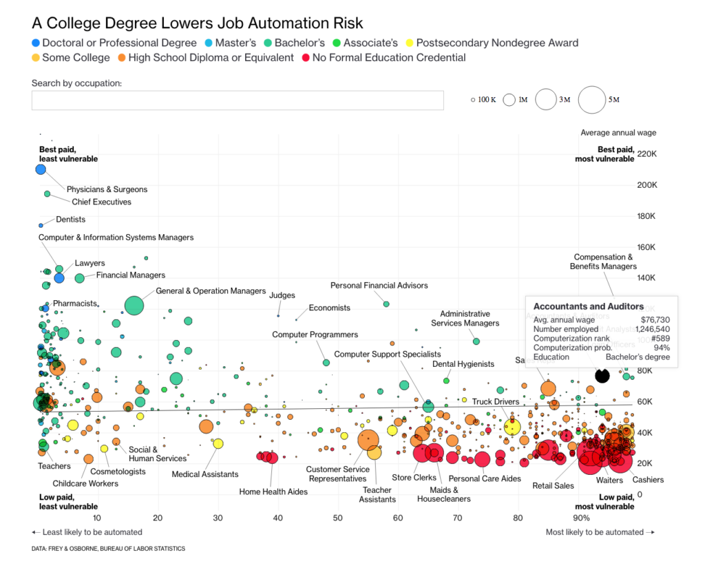
```

---

# Trendy topic: Labour market in Sweden

```{r}
library(gt)
df <- read_rds("literature/svensson_2021.rds")

df %>% 
  pivot_wider(names_from = year) %>%
  gt() %>% 
  data_color(
    columns = `1905`:`1950`,
    colors = scales::col_numeric(
      # custom defined values - notice that order matters!
      palette = c("#ffffff", "#f2fbd2", "#c9ecb4", "#93d3ab", "#35b0ab"),
      domain = NULL
    )
  ) %>% 
  cols_label(title = "") %>% 
   tab_header(
    title = md("**Evolution of professional composition**"),
    subtitle = "Top 100 incomes per year in Malmö"
  ) %>% 
  tab_source_note("Data: Anton Svennson 2022 - strategic sample of Malmö")
```


]]

---

# Trendy topic
### How can we think more clearly about the future of work?

.pull-left[
Look to the past:
How have people responded to technological change?? 

* Swing riots
* Luddites
* Trade Adjustment Assistance in the US

]

.pull-right[

```{r, out.width="60%"}
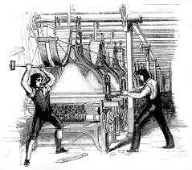
```


]
---
# My topic
### How do people respond to technological change of different types?

.pull-left[

1. Electricity (three papers!)

2. Transportation technology

]

.pull-right[

```{r}


```

.center[[Porjus power plant dam in 1914](https://history.vattenfall.com/stories/from-hydro-power-to-solar-cells/the-pioneer-power-stations) - Vatenfall archives

]]

---
class: inverse, center, middle
name: electricity

# Electricity

<html><div style='float:left'></div><hr color='#EB811B' size=1px width=796px></html>

---

# Electricity

### Where to begin?

.pull-left[

Two pronged approach looking at:

1. Local effects of electrification on labour in Sweden.

2. Labour augmenting vs labour replacing technologies that came along with electricity.

]

.pull-right[

```{r, out.width="50%"}
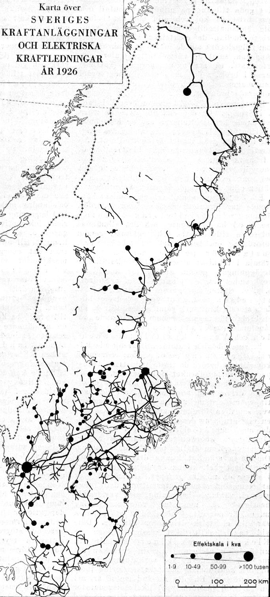
```

.center[[Map of electric grid in 1926](http://www.geni.org/globalenergy/library/national_energy_grid/sweden/swedishnationalelectricitygrid.shtml) - Global Electricity Network Institute

]]

]


---

# Electricity

## Three Papers:

### 1. How does electrification shift workers out of agriculture?

### 2. Electrification as a shock to labour demand: worker skills and internal migration in Sweden

### 3. Labour automation and augmentation as a result of technological change

---
# Electricity 1

### Labour from agric. to new indutry

```{r}
df <- readxl::read_excel("slide_data/employment_by_industry_Sweden_new.xls", skip = 5)

library(ggiraph)

g <- df %>%
  mutate(Year = as.numeric(Year)) %>%
  pivot_longer(-Year) %>%
  filter(!name %in% c("Total aggregate economy", "Total private sector")) %>%
  mutate(tooltip = str_c("Number of employees ", scales::number(value, accuracy = 1))) %>%
  ggplot(aes(Year, value, fill = name, tooltip = tooltip)) +
  geom_tile_interactive(position = "fill") +
  scale_fill_brewer(palette = "Paired") +
  scale_y_continuous(labels = scales::percent_format()) +
  theme(legend.position = "bottom") +
  guides(fill = guide_legend(nrow = 4, byrow = TRUE)) +
  labs(
    caption = "Source: Edvinsson, R. Number of employees in eight types of activities in Sweden 1850-2000\nVia Historia.se",
    fill = NULL,
    y = "Employment composition",
    title = "Employment by sector in Sweden",
    subtitle = "1850-2000"
  )

ggiraph(ggobj = g)

```

.center[Number of employees in eight types of activities in Sweden 1850-2000 [Edvinsson](http://www.historicalstatistics.org/)]


---

# Electricity 1

.pull-left[

### Rapid expansion of general purpose technology

<blockquote>

Between 1915 and 1920 the proportion of the country's arable land belonging to farms with electricity increased from 5 to almost 40 per cent

</blockquote>

]

.pull-right[


```{r, out.width="80%"}
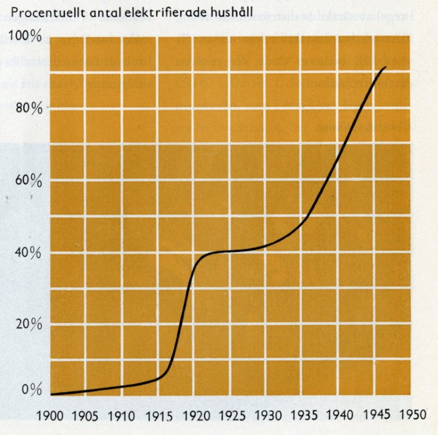
```

.center[[Vattenfall archive](https://history.vattenfall.com/stories/the-revolution-of-electricity/how-electricity-conquered-the-countryside)]

]

---
class: inverse, center, middle

## How does electrification shift workers out of agriculture?

---
# Electricity 1

Simply measure number of workers in different occupations, electricity and agricultural output at parish level.

.pull-left[

```{r, out.width="100%"}
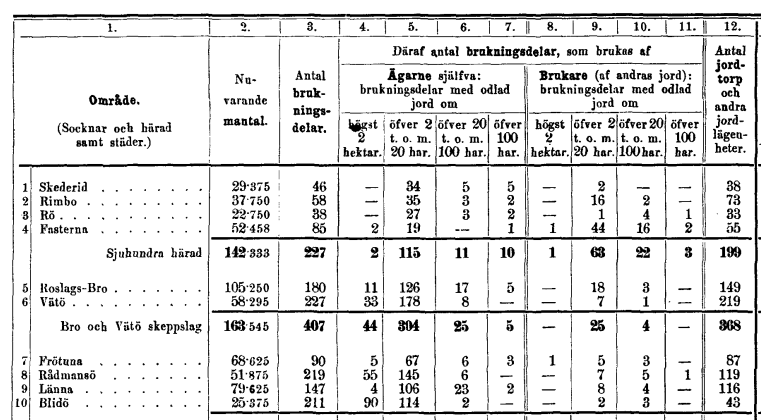
```
]

.pull-right[


```{r, out.width="100%"}
include_graphics("slides/Horses_per_parish.PNG")
```

]

---
# Electricity 1

.panelset[
.panel[.panel-name[Question]

.center[### How does electrification shift workers out of agriculture?]

]

.panel[.panel-name[Data]

```{r}
data <- tibble(sources = c("Detailed electricity coverage maps", 
                           "Agricultural output and employment data"),
               where_from = c("State official investigations into electrification by county",
                              "SCB"),
               status = c("In posession, awaiting digitization",
                          "In posession, awaiting translation"))

kable(data, col.names = c("Sources", "Where from?", "Status"))

```

]

.panel[.panel-name[Methods]

* Diff in diff between parishes that had access to electricity early by virtue of grid connection.

]

.panel[.panel-name[Sticking points]

* Digitizing maps is taking lotsa time

]

.panel[.panel-name[Next steps]

* Do the work!

]]


---

# Electricity #2

### Motivation for looking at micro-level data on workers

There is work on Sweden already looking at [electricity and technology-skill complementary]() by Prado and Theorotidis. This focusses on manufacturing firms.

There is also work examining [labour relations and workers' response to electrification]() in Sweden by Molinder, Karlsson and Enflo. This looks at the first major expansion of the electricity grid.

```{r, out.width="50%"}
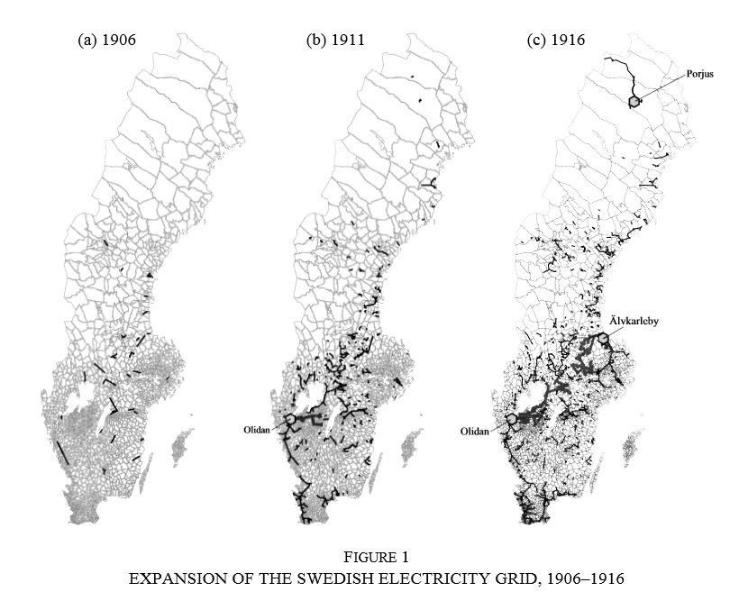
```

---

# Electricity #2

### What can I add?

.pull-left[

New detailed maps of electricity access:

```{r}
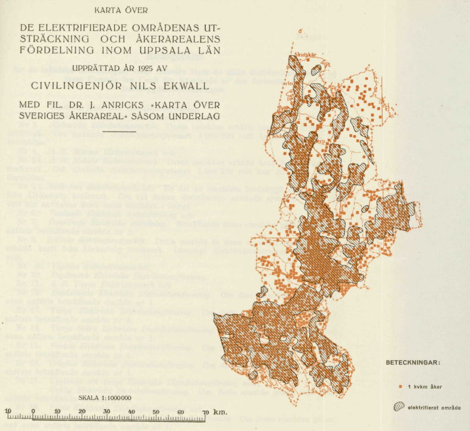
```

[Map of electrification in Uppsala 1924]()

]

.pull-right[

Information on extent of electricity provision:

```{r}
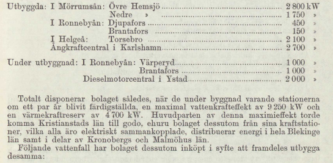
```

[Generation capacity by area in Kristianstad in 1926]()

]
---

# Electricity #2

.panelset[
.panel[.panel-name[Question]

.center[### How much did electrification contribute to the relatively high level of labour migration in Sweden during the first half of the 20th century?]

]

.panel[.panel-name[Data]

```{r}
data <- tibble(sources = c("Detailed electricity coverage maps", 
                           "Information on amount/extent of provision", 
                           "Occupation and labour location data"),
               where_from = c("State official investigations into electrification by county",
                              "State official investigations into electrification by county",
                              "IPUMS census data"),
               status = c("In posession, awaiting digitization",
                          "In posession, awaiting translation",
                          "Awaiting 1930 census from Riksarkivet"))

kable(data, col.names = c("Sources", "Where from?", "Status"))

```

]

.panel[.panel-name[Methods]

```{r}
methods <- c("Descrptive statistics",
             "Lovely fun maps",
             "Exogenous shock of early electrification might persist?") %>% as_tibble()

methods %>% kable(col.names = "Methods")
```


]

.panel[.panel-name[Sticking points]

* Digitizing maps is taking lotsa time

* 1930 census is not complete, but rather has 30% coverage, primarily in areas that have high unemployment today.

]

.panel[.panel-name[Next steps]

* Do the work!

]]

---
# Electricity #3

### How has electrification augmented labour demand and how has it automated away labour?

In Electricity #2 I hope to show how labour moved to areas with electricity to seek new kinds of employment. In paper #2 I want to **quantify the new kinds of employment** and **measure the rate at which new jobs are created and old ones destroyed**.

---
# Electricity #3

### What's the template?

All the big boys write about this stuff:

1. [Goldin and Katz (2008)]() explain the canonical model for labour augmenting technology

1. [Acemoglu and Autor (2011)]() revise the model to account for polarization in the US labour market and introduce automation to the model

1. [Autor, Salomons, Seegmiller (2022)](https://economics.mit.edu/files/21810) attempt to measure the kinds of technologies that replace labour and the kinds that boost labour productivity. They use occupational titles, occupation descriptions and census data. **This is the template**.

---
# Electricity #3

.pull-left[

### Augmentation vs Automation of work

<blockquote>

We hypothesize that new tasks emerge in occupations where new innovations complement their outputs (‘augmentation’) or market size expands, while conversely, employment contracts in occupations where innovations substitute for labour inputs (‘automation’) or market size contracts.

</blockquote>

-- [Autor, Salomons, Seegmiller (2021)](https://economics.mit.edu/files/21810)

]
.pull-right[

### Measuring kinds of work

```{r, fig.out = "50%"}
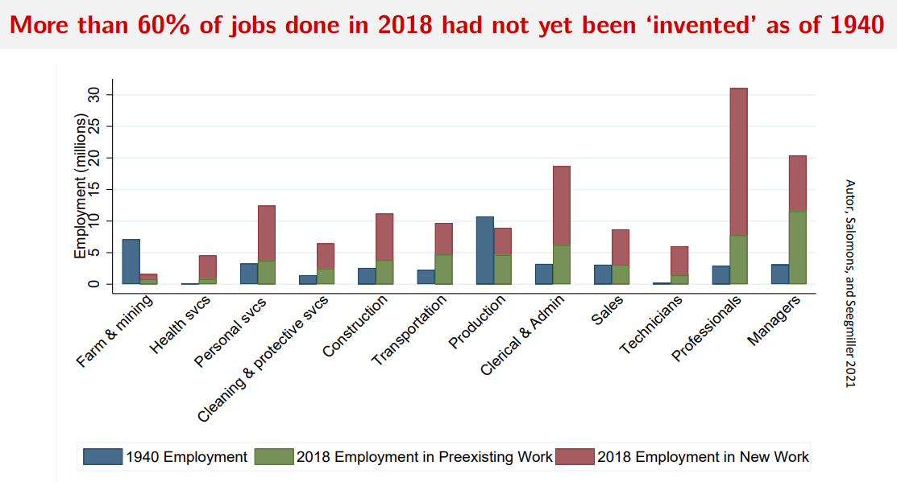
```


]

---

# Electricity #3

### Following methodology of [Autor, Salomons, Seegmiller (2021)](https://economics.mit.edu/files/21810)

<br>

.pull-left[

We want to compare the similarity of:

1. Labour outputs, e.g. occupational titles,

1. Labour inputs, e.g. a description of what the worker does

and

* Types of new technology being brought to market, e.g. patents

]


.pull-right[

```{r}
autor_needs <- tibble(title = "Medical Technologist",
       tasks = "Performs medical laboratory tests, procedures, analyses to provide data for diagnosis, treatment and prevention of disease",
       tech = "Theranos blood testing machine that can do these things")

autor_needs %>% kable(col.names = c("Title", "Task", "Tech"))

icons <- tibble(title = "figures/icons/titles.svg",
                tasks = "figures/icons/descriptions.svg",
                tech = "figures/icons/patents.svg")

autor_needs <- autor_needs %>% 
  bind_rows(icons)

autor_needs %>%
  gt() %>%
  tab_header(title = "Example of Autor, Salomons and Seegmiller comparison") %>%
  tab_style(
    style = cell_borders(sides = "l", color = "grey20", style = "solid", weight = "1px"),
    locations = cells_body(
      columns = everything(),
      rows = everything()
    )
  ) %>%
  tab_style(
    style = cell_text(align = "center"),
    locations = cells_body(
      columns = everything(),
      rows = 2
    )
  ) %>%
  cols_label(
    title = md("**Title**"),
    tasks = md("**Task**"),
    tech = md("**Tech**")
  ) %>%
  text_transform(
    locations = cells_body(
      columns = c(title, tasks, tech),
      rows = 2
    ),
    fn = function(x) {
      local_image(
        filename = paste0(x),
        height = as.numeric(75)
      )
    }
  ) %>% 
    tab_style(
    style = cell_fill(color = "#D3D3D3", alpha = .7),
    locations = cells_column_labels(columns = everything())
  )

```


]


---
# Electricity #3
### Methodology 

Use natural language processing to compare the words used in the occupational titles and occupational descriptions to the corpus of patent data.

More similar to titles -> complement their outputs (‘augmentation’)
More similar to tasks -> substitute for labour inputs (‘automation’)

```{r, out.width="70%"}
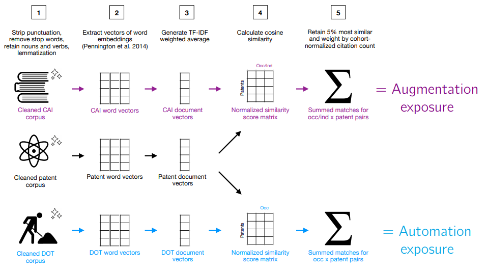
```

---
# Electricity #3

### My data on occupational titles and descriptions over time:

.pull-left[

#### Riksvakanslistan

* State vacancy lists produced weekly between 1915 and 1958

* Records number of vacancies by occupational title and region

* Uncommon occupations are listed in free text below table

* As these occupations become more popular they move onto the grid

* Specifies vacancies by rank in some occupations


]

.pull-right[

```{r, out.width="80%"}
include_graphics("images/riksvakanslistan_21_09_1927.JPG")
```


]
---
# Electricity #3
### My data on patents in Sweden:

.pull-left[

#### 2 Sources

##### Swedish Patent and Registration Office

* 5,960 patents including term electricity

* Long time span from earliest adoption

##### Google Patents Database

* 12,600 patents concentrated in 1970s

* Lovely website that let's you scrape it

]

.pull-right[

```{r, out.width= "100%"}
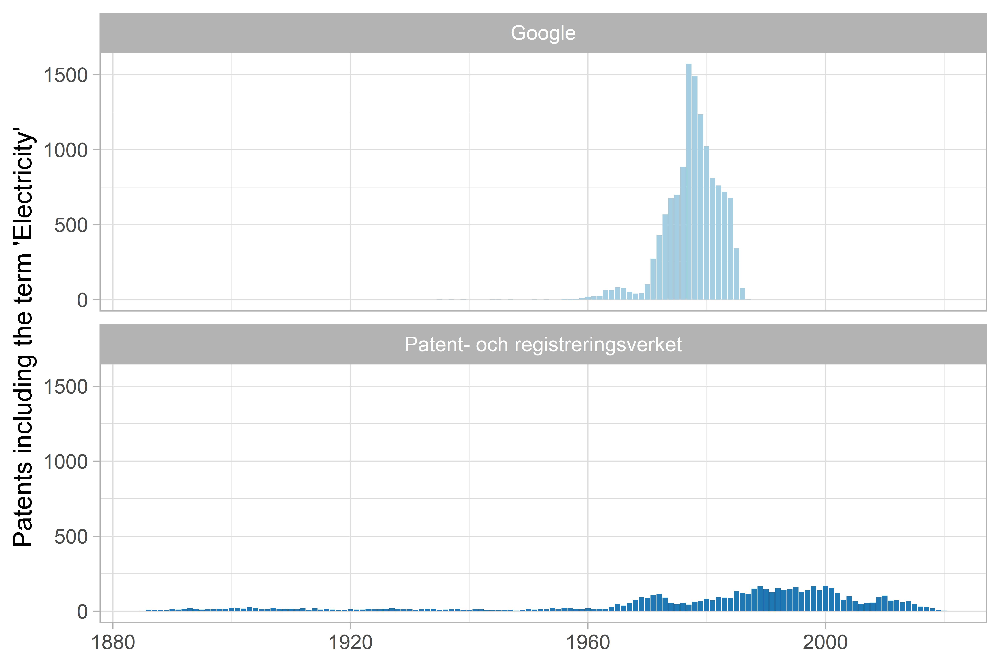
```

[Distribution of number of patents by source](https://github.com/j-jayes/swedish-patent-data)

]

---

# Electricity #3

```{r, out.width= "80%"}
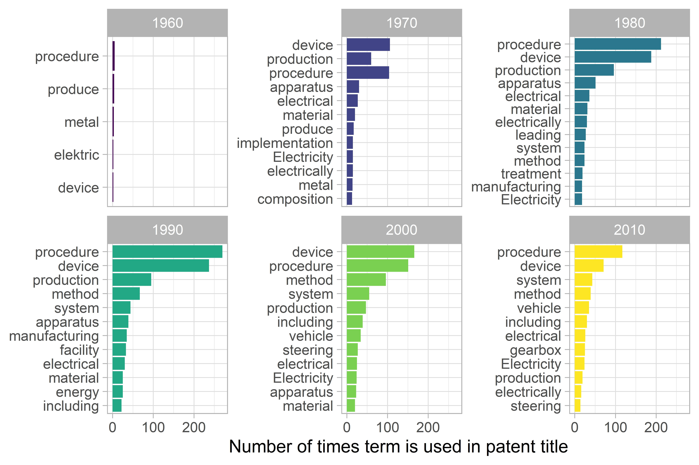
```

.center[
[Term frequency in patent title from Swedish PRV Patent Database](https://github.com/j-jayes/swedish-patent-data)
]

---


# Electricity #3

.panelset[
.panel[.panel-name[Question]

.centre[### What was the rate of creation of creation of new kinds of jobs as a result of electrification, and to what extent was electrification a force for labour augmentation or labour automation?]

]

.panel[.panel-name[Data]

```{r}
data <- tibble(sources = c("Labour outputs or occupational titles", 
                           "Labour inputs or occupational descriptions", 
                           "Swedish patent registration information"),
               where_from = c("Riksvakanslistan",
                              "Riksvakanslistan/HISCO documentation",
                              "Swedish PRV / Google Patents"),
               status = c("In LUB special collections - awaiting permission to scan",
                          "In posession, awaiting translation",
                          "Surmountable problems!!"))

kable(data, col.names = c("Sources", "Where from?", "Status"))

```

]

.panel[.panel-name[Methods]

```{r}
methods <- c("Digitize and make machine readable Riksvakanslistan",
             "Descrptive statistics",
             "Natual Language Processing / Machine Learning",
             "A little bit of maths") %>% as_tibble()

methods %>% kable(col.names = "Methods")
```


]

.panel[.panel-name[Sticking points]

```{r, out.width="50%"}
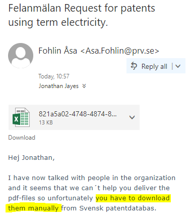
```


]

.panel[.panel-name[Next steps]

* Do the work!

* Ask PRV if they can give me programmatic access to their server

* Finish scraping Google Patents database

]]

---
class: inverse, center, middle
name: transportation

# Transportation technology

<html><div style='float:left'></div><hr color='#EB811B' size=1px width=796px></html>

---

# Transportation technology

### How many jobs can you take the tube to in London?

The Roy model (1951) says as a worker you should do the thing that you have the highest comparative advantage in.

If you live on an fishing island, the cost of travel prevents you from becoming a banker. If you live in London, you can take the tube.

```{r, out.width="50%"}
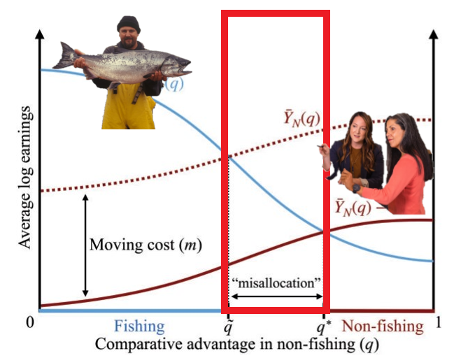
```

---
# Transportation technology

### Stockholm was reimainged in the second half of the 20th century

The city adopted modernist architectural ideals:

* Separating work from home

* Destroying housing in the city centre

* Building highways and expanding the metro to enable commuting

Interesting economic questions about when the transport infrastructure was built:

* Did it enable people to commute to more jobs - different jobs - better jobs?

---

# Transportation technology

### How to answer these questions with individual level data?

.pull-left[

The Stockholm city archive have mantalslängder that record:

* Name
* Occupational title 
* Home address
* Workplace name

]

.pull-right[

Follow individuals over time! See their commutes pre- and post-metro construction/expansion

```{r}

```


]


---

# Transportation technology
### Methods to assess job mobility / individual mobility

1. Assign individuals to geocoded home locations based on address

1. Geocode workplaces perhaps using workplace calendar

1. Follow how occupational title and distance between work and home changed over time!

1. If no matching, just track distance between work and home over time by occupation / social class.

Can answer questions like:

* Who was made worse off by dividing the city?

* Who had better access to city amenities as a response to infrastructure?

---
# Transportation technology
### Methods to assess individual mobility

If not possible to match over time, identifying clusters of commuting zones may be interesting, e.g.

```{r, out.width="60%"}
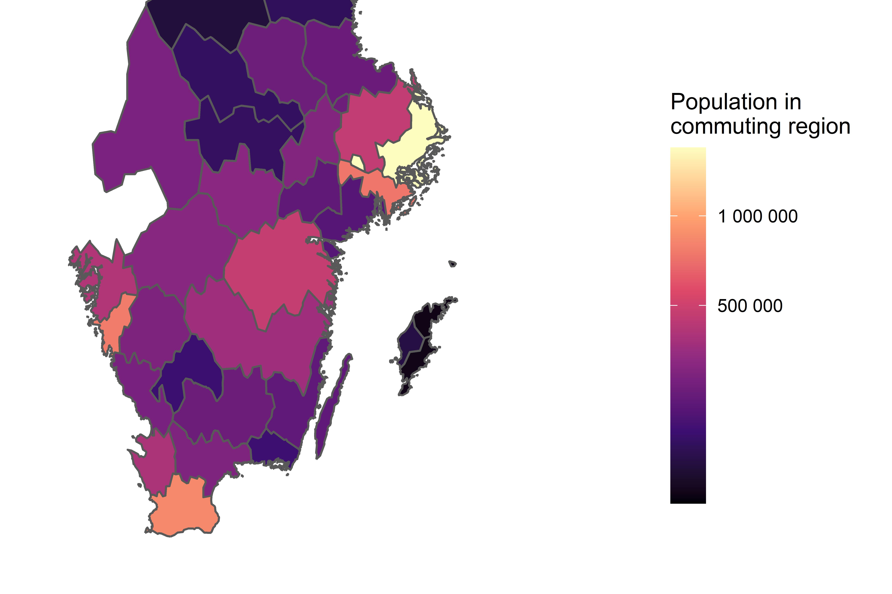
```

Map of Southern Sweden draw by commuting zones of 2021 rather than admin boundary. [Source: Data for Good from Meta](https://dataforgood.facebook.com/dfg/tools/commuting-zones)

---
# Transportation technology

.panelset[
.panel[.panel-name[Question]

.center[### How did the introduction of new transportation technologies in Stockholm impact matching in the labour market, in conjunction with a redesign of the city?]

]

.panel[.panel-name[Data]

```{r}
data <- tibble(
  sources = c(
    "Individual records of occupation, home address and workplace name",
    "Metro construction maps",
    "Workplace addresses"
  ),
  where_from = c(
    "Mantalslängder at SCA",
    "Spårvägsmuseet",
    "Calendar of workplaces / telephone books"
  ),
  status = c(
    "Have to go and visit Stockholm to scan these",
    "In posession, awaiting translation",
    "???"
  )
)

kable(data, col.names = c("Sources", "Where from?", "Status"))

```

]

.panel[.panel-name[Methods]

```{r}
methods <- c("Geocoding addresses / detective work",
             "Lovely fun maps",
             "Fixed Effects estimator if observing individuals over time") %>% as_tibble()

methods %>% kable(col.names = "Methods")
```


]

.panel[.panel-name[Sticking points]

* Digitizing individual records from big books is going to be tricky

* Scanning the books with a proper book scanning machine is likely to give best quality scans and damage the books the least. Need to assess if this is possible.

]

.panel[.panel-name[Next steps]

* Travel to Stockholm to get first impression of sources probably most NB.

]]

---

class: inverse, center, middle

# Thank you


