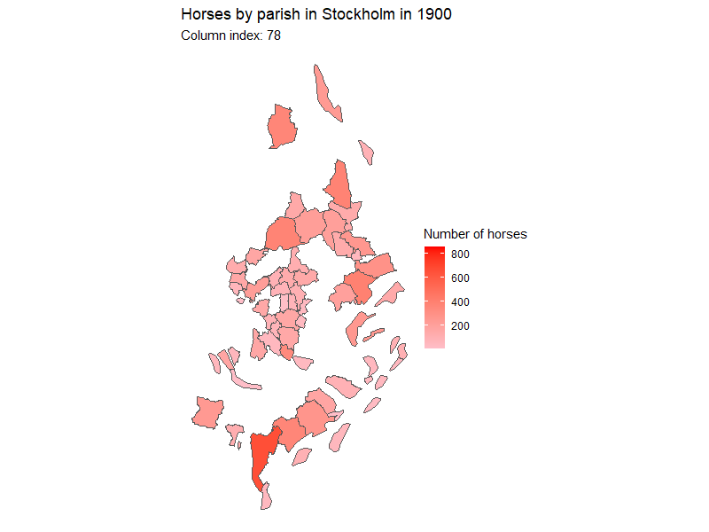
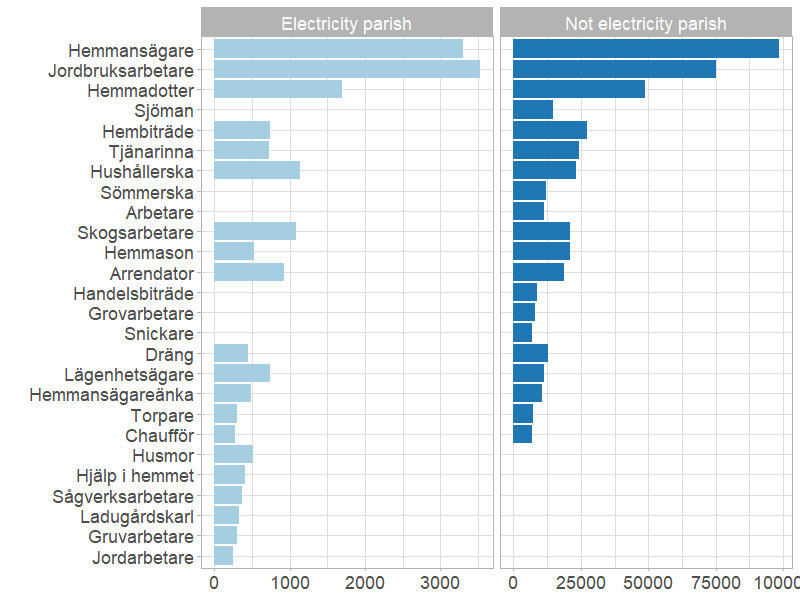
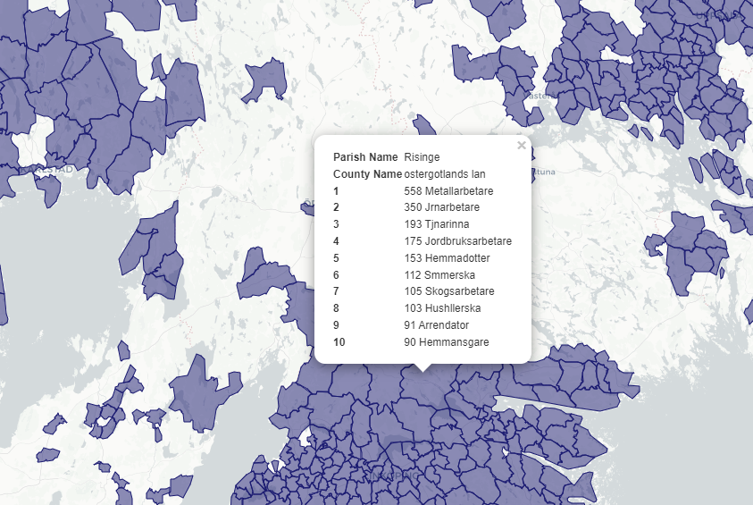
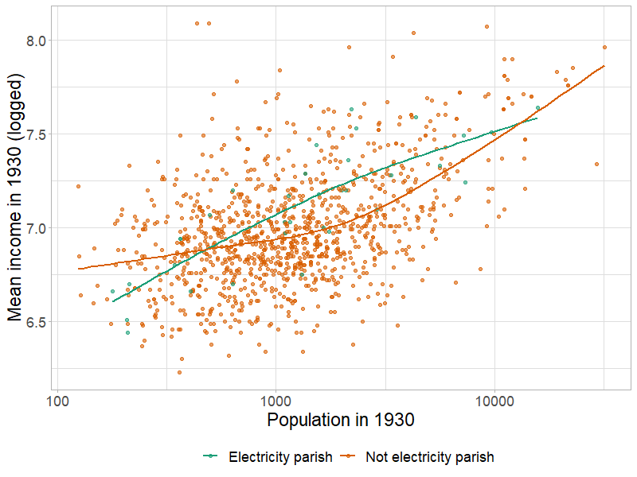
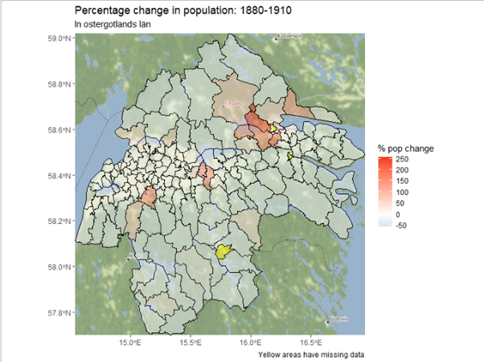

```{r, echo=F, message=F, warning=F}

# options(htmltools.dir.version = FALSE)
library(knitr)

opts_chunk$set(
  fig.align="center",  
  fig.height=4, 
  # dev = "svg",
  #fig.width=6,
  # out.width="748px", #out.length="520.75px",
  # dpi=300, #fig.path='Figs/',
  cache=T, echo=F, warning=F, message=F
)


library(hrbrthemes)
library(fontawesome)

library(xaringan)
library(xaringanExtra)
library(tidyverse)
library(here)
library(xaringanthemer)

xaringanExtra::use_panelset()
```

```{r}
xaringanExtra::use_progress_bar(color = "#EB821D", location = "top", height = "5px")
```


# Trendy topic: The future of work!

```{r, out.width="80%"}
knitr::include_graphics("images/exposure_risk.png")
```

---

# Trendy topic: Labour market in Sweden

```{r}
library(gt)
df <- read_rds("literature/svensson_2021.rds")

df %>% 
  pivot_wider(names_from = year) %>%
  gt() %>% 
  data_color(
    columns = `1905`:`1950`,
    colors = scales::col_numeric(
      # custom defined values - notice that order matters!
      palette = c("#ffffff", "#f2fbd2", "#c9ecb4", "#93d3ab", "#35b0ab"),
      domain = NULL
    )
  ) %>% 
  cols_label(title = "") %>% 
   tab_header(
    title = md("**Evolution of professional composition**"),
    subtitle = "Top 100 incomes per year in Malmö"
  ) %>% 
  tab_source_note("Data: Anton Svennson 2022 - strategic sample of Malmö")
```


---

# Trendy topic
### How can we think more clearly about the future of work?

.pull-left[
Look to the past:
How have people responded to technological change?? 

* Swing riots
* Luddites
* Trade Adjustment Assistance in the US

]

.pull-right[

```{r, out.width="60%"}
knitr::include_graphics("images/luddites.jpg")
```


]
---
# My topic
### How does labour respond to technological shock of electrification?

.pull-left[

### A focus on:

1. Agricultural output and employment

2. Worker skills and agglomoration economies

3. Migration and skills

4. Measuring new kinds of work


]

.pull-right[

```{r}

knitr::include_graphics("images/porjus_hydro.jpg")

```

.center[[Porjus power plant dam in 1914](https://history.vattenfall.com/stories/from-hydro-power-to-solar-cells/the-pioneer-power-stations) - Vatenfall archives

]]

---
class: inverse, center, middle
name: electricity

# Electricity

<html><div style='float:left'></div><hr color='#EB811B' size=1px width=796px></html>

---

# Electricity

### Where to begin?

.pull-left[

Two pronged approach looking at:

1. Local effects of electrification on labour in Sweden. (Three papers)

2. Labour augmenting vs labour replacing technologies that came along with electricity.

]

.pull-right[

```{r, out.width="50%"}
include_graphics("images/Electricity_map_sweden_1926.jpg")
```

.center[[Map of electric grid in 1926](http://www.geni.org/globalenergy/library/national_energy_grid/sweden/swedishnationalelectricitygrid.shtml) - Global Electricity Network Institute

]]

]


---

# Electricity in the local labour market

## Three Papers:

### 1. How does electrification shift workers out of agriculture?

### 2. Worker skills and agglomoration effects

### 2. ‘Praise the people or praise the place’: migration and skills


---
# Paper 1

### Labour from agric. to new indutry

```{r}
df <- readxl::read_excel("slide_data/employment_by_industry_Sweden_new.xls", skip = 5)

library(ggiraph)

g <- df %>%
  mutate(Year = as.numeric(Year)) %>%
  pivot_longer(-Year) %>%
  filter(!name %in% c("Total aggregate economy", "Total private sector")) %>%
  mutate(tooltip = str_c("Number of employees ", scales::number(value, accuracy = 1))) %>%
  ggplot(aes(Year, value, fill = name, tooltip = tooltip)) +
  geom_tile_interactive(position = "fill") +
  scale_fill_brewer(palette = "Paired") +
  scale_y_continuous(labels = scales::percent_format()) +
  theme(legend.position = "bottom") +
  guides(fill = guide_legend(nrow = 4, byrow = TRUE)) +
  labs(
    caption = "Source: Edvinsson, R. Number of employees in eight types of activities in Sweden 1850-2000\nVia Historia.se",
    fill = NULL,
    y = "Employment composition",
    title = "Employment by sector in Sweden",
    subtitle = "1850-2000"
  )

ggiraph(ggobj = g)

```

.center[Number of employees in eight types of activities in Sweden 1850-2000 [Edvinsson](http://www.historicalstatistics.org/)]


---

# Electricity 1

.pull-left[

### Rapid expansion of general purpose technology

<blockquote>

Between 1915 and 1920 the proportion of the country's arable land belonging to farms with electricity increased from 5 to almost 40 per cent

</blockquote>

]

.pull-right[


```{r, out.width="80%"}
include_graphics("slides/vattenfall_consumption.jpg")
```

.center[[Vattenfall archive](https://history.vattenfall.com/stories/the-revolution-of-electricity/how-electricity-conquered-the-countryside)]

]

---
class: inverse, center, middle

## How does electrification shift workers out of agriculture?

---
# Paper 1

### Leverage the quasi-random allocation of a 192 parishes to grid connection on line between Olidan and Älvkarleby hydro plants.

Simply measure number of workers in agric. prior to electrification, and agricultural output at parish level. Track how these develop after electrification.

.pull-left[

```{r, out.width="100%"}
include_graphics("slides/agric_data.PNG")
```

.center[Agricultural output statistics from [SCB](http://www.historicalstatistics.org/)]

]

.pull-right[


```{r, out.width="100%"}

```

]

---

# [Data explorer](https://jonathan-jayes.shinyapps.io/Sweden-electrification-explorer/)

```{r}
knitr::include_url("https://jonathan-jayes.shinyapps.io/Sweden-electrification-explorer/", height = 500)
```


---
# Paper 1

.panelset[
.panel[.panel-name[Question]

.center[### How does electrification shift workers out of agriculture?]

]

.panel[.panel-name[Data]

```{r}
data <- tibble(sources = c("Detailed electricity coverage maps", 
                           "Agricultural output and employment data"),
               where_from = c("State official investigations into electrification by county",
                              "SCB"),
               status = c("In posession, awaiting digitization",
                          "In posession, awaiting translation"))

kable(data, col.names = c("Sources", "Where from?", "Status"))

```

]

.panel[.panel-name[Methods]

* Diff in diff between parishes that had access to electricity early by virtue of grid connection.

]

.panel[.panel-name[Sticking points]

* Digitizing maps is taking lotsa time

]

.panel[.panel-name[Next steps]

* Do the work!

]]


---

# Paper 2

### Motivation for looking at micro-level data on workers

There is work on Sweden already looking at [electricity and technology-skill complementary]() by Prado and Theorotidis. This focusses on manufacturing firms.

There is also work examining [labour relations and workers' response to electrification]() in Sweden by Molinder, Karlsson and Enflo. This looks at the first major expansion of the electricity grid.

```{r, out.width="50%"}
knitr::include_graphics("images/more_power_to_the_people.PNG")
```

---

# Paper 2

### What can I add?

Going beyond the average treatment effect.

.pull-left[

What kinds of workers from electrification?

```{r}

```

[20 most common occupations by parish type]()

]

.pull-right[

Agglomeration effects and specialization

```{r}

```

[Most common occupations in Risinge Parish]()

]
---
# Paper 2

### Agglomoration effects

```{r, out.width="80%"}

```


---
# Paper 2

.panelset[
.panel[.panel-name[Question]

.center[### What kinds of workers were made better off by electrification?]

]

.panel[.panel-name[Data]

```{r}
data <- tibble(sources = c("Detailed electricity coverage maps", 
                           "Information on amount/extent of provision", 
                           "Occupation and labour location data"),
               where_from = c("State official investigations into electrification by county",
                              "State official investigations into electrification by county",
                              "IPUMS census data"),
               status = c("In posession, awaiting digitization",
                          "In posession, awaiting translation",
                          "Examining 1930 census for coverage issues"))

kable(data, col.names = c("Sources", "Where from?", "Status"))

```

]

.panel[.panel-name[Methods]

```{r}
methods <- c("Logistic regression",
             "Lovely fun maps",
             "Exogenous shock of early electrification might persist") %>% as_tibble()

methods %>% kable(col.names = "Methods")
```


]

.panel[.panel-name[Sticking points]

* Digitizing maps is taking lotsa time

* 1930 census is not complete, but rather has 30% coverage, primarily in areas that have high unemployment today.

]

.panel[.panel-name[Next steps]

* Do the work!

]]

---
# Paper 3

## ‘Praise the people or praise the place’: migration and skills

#### Paper two looked at the kinds of workers who benefitted from elecrifcation, focussing on skills and agglomoration effects.

### In paper three we focus on migration: did workers from an electricity parish do the new kinds of work created, or were migrants responsible for the new kinds of work done?

---
# Paper 3

### The 1930 census tells us where individuals were born and where they lived in 1925.

```{r, out.width="80%"}

```


---

# Paper 3

.panelset[
.panel[.panel-name[Question]

.center[### How much did electrification contribute to the relatively high level of labour migration in Sweden during the first half of the 20th century?]

]

.panel[.panel-name[Data]

```{r}
data <- tibble(sources = c("Detailed electricity coverage maps", 
                           "Information on amount/extent of provision", 
                           "Occupation and labour location data"),
               where_from = c("State official investigations into electrification by county",
                              "State official investigations into electrification by county",
                              "IPUMS census data"),
               status = c("In posession, awaiting digitization",
                          "In posession, awaiting translation",
                          "Examining 1930 census for coverage issues"))

kable(data, col.names = c("Sources", "Where from?", "Status"))

```

]

.panel[.panel-name[Methods]

```{r}
methods <- c("Counterfactual construction of mover and stayer parishes",
             "Marginal treatment effect analysis") %>% as_tibble()

methods %>% kable(col.names = "Methods")
```


]

.panel[.panel-name[Sticking points]

* Digitizing maps is taking lotsa time

* 1930 census is not complete, but rather has 30% coverage, primarily in areas that have high unemployment today.

]

.panel[.panel-name[Next steps]

* Do the work!

]]

---
class: inverse, center, middle
name: transportation

# Labour Automation and Augmentation

<html><div style='float:left'></div><hr color='#EB811B' size=1px width=796px></html>
---


# Paper 4

### How has electrification augmented labour demand and how has it automated away labour?

In paper 3 I hope to show how labour moved to areas with electricity to seek new kinds of employment. In paper 4 I want to **quantify the new kinds of employment** and **measure the rate at which new jobs are created and old ones destroyed**.

---
# Paper 4

### What's the template?

All the big boys write about this stuff:

1. [Goldin and Katz (2008)]() explain the canonical model for labour augmenting technology

1. [Acemoglu and Autor (2011)]() revise the model to account for polarization in the US labour market and introduce automation to the model

1. [Autor, Salomons, Seegmiller (2022)](https://economics.mit.edu/files/21810) attempt to measure the kinds of technologies that replace labour and the kinds that boost labour productivity. They use occupational titles, occupation descriptions and census data. **This is the template**.

---
# Paper 4

.pull-left[

### Augmentation vs Automation of work

<blockquote>

We hypothesize that new tasks emerge in occupations where new innovations complement their outputs (‘augmentation’) or market size expands, while conversely, employment contracts in occupations where innovations substitute for labour inputs (‘automation’) or market size contracts.

</blockquote>

-- [Autor, Salomons, Seegmiller (2021)](https://economics.mit.edu/files/21810)

]
.pull-right[

### Measuring kinds of work

```{r, fig.out = "50%"}
include_graphics("images/autor_kinds_of_work.PNG")
```


]

---

# Paper 4

### Following methodology of [Autor, Salomons, Seegmiller (2021)](https://economics.mit.edu/files/21810)

<br>

.pull-left[

We want to compare the similarity of:

1. Labour outputs, e.g. occupational titles,

1. Labour inputs, e.g. a description of what the worker does

and

* Types of new technology being brought to market, e.g. patents

]


.pull-right[

```{r}
autor_needs <- tibble(title = "Medical Technologist",
       tasks = "Performs medical laboratory tests, procedures, analyses to provide data for diagnosis, treatment and prevention of disease",
       tech = "Theranos blood testing machine that can do these things")

autor_needs %>% kable(col.names = c("Title", "Task", "Tech"))

icons <- tibble(title = "figures/icons/titles.svg",
                tasks = "figures/icons/descriptions.svg",
                tech = "figures/icons/patents.svg")

autor_needs <- autor_needs %>% 
  bind_rows(icons)

autor_needs %>%
  gt() %>%
  tab_header(title = "Example of Autor, Salomons and Seegmiller comparison") %>%
  tab_style(
    style = cell_borders(sides = "l", color = "grey20", style = "solid", weight = "1px"),
    locations = cells_body(
      columns = everything(),
      rows = everything()
    )
  ) %>%
  tab_style(
    style = cell_text(align = "center"),
    locations = cells_body(
      columns = everything(),
      rows = 2
    )
  ) %>%
  cols_label(
    title = md("**Title**"),
    tasks = md("**Task**"),
    tech = md("**Tech**")
  ) %>%
  text_transform(
    locations = cells_body(
      columns = c(title, tasks, tech),
      rows = 2
    ),
    fn = function(x) {
      local_image(
        filename = paste0(x),
        height = as.numeric(75)
      )
    }
  ) %>% 
    tab_style(
    style = cell_fill(color = "#D3D3D3", alpha = .7),
    locations = cells_column_labels(columns = everything())
  )

```


]


---
# Paper 4
### Methodology 

Use natural language processing to compare the words used in the occupational titles and occupational descriptions to the corpus of patent data.

More similar to titles -> complement their outputs (‘augmentation’)
More similar to tasks -> substitute for labour inputs (‘automation’)

```{r, out.width="70%"}
include_graphics("images/autor_methodology.PNG")
```

---
# Paper 4

### My data on occupational titles and descriptions over time:

.pull-left[

#### Riksvakanslistan

* State vacancy lists produced weekly between 1915 and 1958

* Records number of vacancies by occupational title and region

* Uncommon occupations are listed in free text below table

* As these occupations become more popular they move onto the grid

* Specifies vacancies by rank in some occupations


]

.pull-right[

```{r, out.width="80%"}
include_graphics("images/riksvakanslistan_21_09_1927.JPG")
```


]
---
# Paper 4

### My data on patents in Sweden:

.pull-left[

#### 2 Sources

##### Swedish Patent and Registration Office

* 5,960 patents including term electricity

* Long time span from earliest adoption

##### Google Patents Database

* 12,600 patents concentrated in 1970s

* Lovely website that let's you scrape it

]

.pull-right[

```{r, out.width= "100%"}
include_graphics("images/patent_counts_by_source.jpeg")
```

[Distribution of number of patents by source](https://github.com/j-jayes/swedish-patent-data)

]


---


# Paper 4


.panelset[
.panel[.panel-name[Question]

.centre[### What was the rate of creation of creation of new kinds of jobs as a result of electrification, and to what extent was electrification a force for labour augmentation or labour automation?]

]

.panel[.panel-name[Data]

```{r}
data <- tibble(sources = c("Labour outputs or occupational titles", 
                           "Labour inputs or occupational descriptions", 
                           "Swedish patent registration information"),
               where_from = c("Riksvakanslistan",
                              "Riksvakanslistan/HISCO documentation",
                              "Swedish PRV / Google Patents"),
               status = c("In LUB special collections - awaiting permission to scan",
                          "In posession, awaiting translation",
                          "Surmountable problems!!"))

kable(data, col.names = c("Sources", "Where from?", "Status"))

```

]

.panel[.panel-name[Methods]

```{r}
methods <- c("Digitize and make machine readable Riksvakanslistan",
             "Descrptive statistics",
             "Natual Language Processing / Machine Learning",
             "A little bit of maths") %>% as_tibble()

methods %>% kable(col.names = "Methods")
```


]

.panel[.panel-name[Sticking points]

```{r, out.width="50%"}
include_graphics("images/prv_patents_email_manual_download.PNG")
```


]

.panel[.panel-name[Next steps]

* Do the work!

* Ask PRV if they can give me programmatic access to their server

* Finish scraping Google Patents database

]]


---

class: inverse, center, middle

# Thank you


